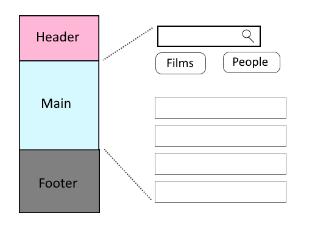

# Examinationsuppgift
## Star Wars info

Din uppgift är att bygga en Vue-app, som använder Star Wars API för att ta fram information till användaren. I uppgiften ingår att läsa dokumentationen till API:et och att tolka datan. https://swapi.dev/

### Mockup
Skiss över de olika delarna i appen. Observera att du ska välja dina egna färger, teckensnitt osv.

### Specifikation
Appen ska ha tre delar, som ligger i kolumn: header, main och footer. De ska ha varsin komponent. Det ska vara en SPA, alltså ska sidan bara laddas en gång av webbläsaren.

*Header* ska innehålla en liten logga och namnet på din app.

*Main* ska ha tre delar: ett sökfält, menyalternativ för att välja vy, och en lista med data från API:et. Sökfältet används för att filtrera datan. När man skriver i fältet, ska bara de listelement finnas kvar vars namn innehåller det man skrivit. Appen ska ha två olika vyer: *Films* och *People*. När appen laddats ska upp till de 10 första sökresultaten från API:et hämtas och visas. Sökfältet och listan ska vara i olika komponenter. Använd props och $emit för att skicka information mellan dem.

*Footer* ska tala om vem du är och vad appen går ut på. Till exempel vilken kurs du går, vad som är syftet med appen och vad man kan göra med den.

För filmerna ska din app visa `title, episode_id, "opening crawl" och release_date`.

För karaktärerna ska din app visa `name, birth_year och eye_color`.

**För VG**:
+ Appen ska visa hur många resultat det finns i API:et. Man ska kunna klicka på en knapp för att hämta de 10 nästa resultaten från API:et, eller de 10 föregående, om de finns.
+ Listan med data: Film-objekt innehåller bland annat länkar till karaktärer. Skapa knappar som man kan klicka på, för att hämta information om en specifik karaktär.
+ För karaktärer: appen ska visa titeln på de filmer man varit med i.

### Inlämning
Lämna in på LearnPoint:
+ ett zip-arkiv med alla filer i ditt git-repo - men inte node_modules
+ ett textmeddelande som innehåller länken till ditt repo på GitHub

### Bedömning
**För G krävs**
+ korrekt inlämning
+ appen uppfyller specen
+ appen hämtar data från API:et
+ appen är stylad med CSS

**För VG krävs**
+ alla G-kriterier uppfyllda
+ kunna bläddra i datan
+ hämta information om specifik karaktär, från films-vyn
+ visa titeln på filmer en karaktär medverkat i, från people-vyn

### Mål ur kursplanen

Efter genomgången kurs skall den studerande ha:

**Kunskaper i:**
+ Syntax och terminologi
+ Verktyg och metoder för webbutveckling
+ Webbapplikationers kopplingar till server, databas och nätverk

**Färdigheter i att:**
+ Utveckla webbsidor med HTML, CSS och JavaScript
+ Utveckla dynamiska webbsidor, webbapplikationer och webbtjänster med olika ramverk för webbutveckling
+ Utveckla applikationer för olika enheter

**Kompetenser i att:**
+ Formulera och lösa problem
+ Bedöma och anpassa applikationer

Icke godkänt (IG)
Den studerande har fullföljt kursen men inte uppnått alla mål för kursen.

Godkänt (G)
Den studerande har uppnått samtliga mål för kursen.

Väl godkänt (VG)
Den studerande har uppnått samtliga mål för kursen. Den studerande kan dessutom självständigt analysera, bedöma och/eller utvärdera reella problem inom ämnesområdet genom att använda kursens lärandemål.
